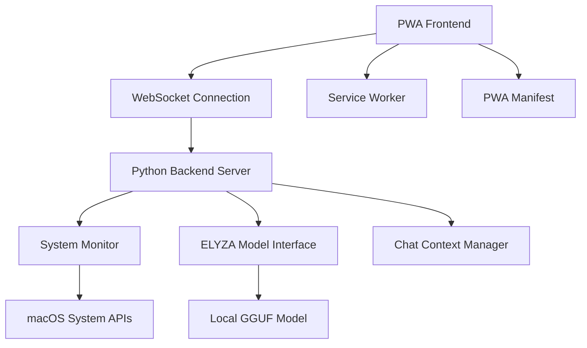

# 設計書

## 概要

Mac Status PWAは、ローカルで動作するELYZA-japanese-Llama-2-7bモデルを使用して、Macのシステム状態を自然言語で報告するProgressive Web Applicationです。Apple風の洗練されたデザインを採用し、チャットインターフェースを通じてユーザーとやり取りします。

## アーキテクチャ

### システム全体構成



### 技術スタック

**フロントエンド (PWA)**
- HTML5/CSS3/JavaScript (ES6+)
- PWA機能: Service Worker, Web App Manifest
- WebSocket Client for real-time communication
- Apple Design System inspired UI components

**バックエンド (Python 3.12)**
- FastAPI for WebSocket server and API endpoints
- llama-cpp-python for ELYZA model integration
- psutil for system monitoring
- asyncio for concurrent processing

**モデル**
- ELYZA-japanese-Llama-2-7b-instruct.Q4_0.gguf
- llama.cpp backend optimized for M1

## コンポーネントと インターフェース

### 1. PWA Frontend Components

#### ChatInterface
```javascript
class ChatInterface {
  constructor() {
    this.websocket = null;
    this.messageHistory = [];
    this.isConnected = false;
  }
  
  async connect() { /* WebSocket接続 */ }
  sendMessage(message) { /* メッセージ送信 */ }
  displayMessage(message, isUser) { /* メッセージ表示 */ }
  applyAppleDesign() { /* Apple風スタイル適用 */ }
}
```

#### SystemStatusDisplay
```javascript
class SystemStatusDisplay {
  constructor() {
    this.currentStatus = {};
  }
  
  updateStatus(statusData) { /* ステータス更新 */ }
  renderStatusCards() { /* ステータスカード表示 */ }
  animateChanges() { /* 変更アニメーション */ }
}
```

#### PWAManager
```javascript
class PWAManager {
  constructor() {
    this.serviceWorker = null;
  }
  
  async registerServiceWorker() { /* SW登録 */ }
  handleInstallPrompt() { /* インストールプロンプト */ }
  enableOfflineMode() { /* オフライン機能 */ }
}
```

### 2. Python Backend Components

#### WebSocketServer
```python
class WebSocketServer:
    def __init__(self):
        self.app = FastAPI()
        self.active_connections = []
        
    async def websocket_endpoint(self, websocket: WebSocket):
        # WebSocket接続処理
        pass
        
    async def broadcast_status(self, status_data: dict):
        # ステータス配信
        pass
```

#### SystemMonitor
```python
class SystemMonitor:
    def __init__(self):
        self.update_interval = 5.0
        
    async def get_system_info(self) -> dict:
        # CPU, メモリ, ディスク情報取得
        return {
            'cpu_percent': psutil.cpu_percent(),
            'memory': psutil.virtual_memory()._asdict(),
            'disk': psutil.disk_usage('/')._asdict(),
            'processes': self.get_top_processes()
        }
        
    def get_top_processes(self) -> list:
        # 上位プロセス取得
        pass
```

#### ELYZAModelInterface
```python
class ELYZAModelInterface:
    def __init__(self, model_path: str):
        self.model_path = model_path
        self.llm = None
        
    async def initialize_model(self):
        # M1最適化設定でモデル初期化
        from llama_cpp import Llama
        self.llm = Llama(
            model_path=self.model_path,
            n_gpu_layers=-1,  # M1 GPU使用
            n_ctx=2048,
            verbose=False
        )
        
    async def generate_response(self, prompt: str, system_data: dict) -> str:
        # システムデータを含むプロンプト生成と応答
        pass
```

#### ChatContextManager
```python
class ChatContextManager:
    def __init__(self):
        self.conversation_history = []
        self.user_preferences = {}
        
    def add_message(self, role: str, content: str):
        # 会話履歴追加
        pass
        
    def get_context_prompt(self, system_data: dict) -> str:
        # コンテキスト付きプロンプト生成
        pass
        
    def personalize_response(self, response: str) -> str:
        # パーソナライズ処理
        pass
```

## データモデル

### SystemStatus
```python
@dataclass
class SystemStatus:
    timestamp: datetime
    cpu_percent: float
    memory_used: int
    memory_total: int
    disk_used: int
    disk_total: int
    top_processes: List[ProcessInfo]
    network_io: NetworkStats
    temperature: Optional[float]
```

### ChatMessage
```python
@dataclass
class ChatMessage:
    id: str
    timestamp: datetime
    role: str  # 'user' or 'assistant'
    content: str
    system_context: Optional[SystemStatus]
```

### UserPreferences
```python
@dataclass
class UserPreferences:
    language_style: str
    notification_level: str
    preferred_metrics: List[str]
    response_personality: str
```

## エラーハンドリング

### 1. モデル関連エラー
- モデルファイル不存在: 明確なエラーメッセージとセットアップガイド表示
- メモリ不足: モデルパラメータ調整提案
- 応答タイムアウト: フォールバック応答提供

### 2. システム監視エラー
- 権限不足: 必要な権限の説明と取得方法案内
- API呼び出し失敗: 代替データソース使用
- データ取得遅延: キャッシュデータ使用

### 3. WebSocket接続エラー
- 接続失敗: 自動再接続機能
- メッセージ送信失敗: ローカルキューイング
- サーバー停止: オフラインモード切り替え

## テスト戦略

### 1. ユニットテスト
- SystemMonitor: システム情報取得の正確性
- ELYZAModelInterface: モデル応答の品質
- ChatContextManager: コンテキスト管理

### 2. 統合テスト
- WebSocket通信: フロントエンド-バックエンド連携
- PWA機能: インストール、オフライン動作
- エンドツーエンド: ユーザーシナリオ全体

### 3. パフォーマンステスト
- モデル応答時間: 5秒以内の応答確保
- メモリ使用量: M1チップでの最適化確認
- 同時接続: 複数ブラウザタブでの動作

### 4. ユーザビリティテスト
- Apple風デザイン: macOSとの視覚的一貫性
- 会話の自然さ: 日本語応答の品質
- パーソナライゼーション: 学習機能の効果

## Apple風デザイン実装

### 1. カラーパレット
```css
:root {
  --apple-blue: #007AFF;
  --apple-gray: #8E8E93;
  --apple-light-gray: #F2F2F7;
  --apple-dark-gray: #1C1C1E;
  --apple-green: #34C759;
  --apple-red: #FF3B30;
  --apple-background: #FFFFFF;
  --apple-secondary-background: #F2F2F7;
}
```

### 2. タイポグラフィ
- SF Pro Display/Text フォントファミリー使用
- Dynamic Type対応
- 適切な行間とレタースペーシング

### 3. アニメーション
- Core Animation inspired transitions
- Ease-in-out timing functions
- Subtle bounce effects for interactions

### 4. レイアウト
- Card-based design
- Generous whitespace
- Consistent padding and margins
- Responsive grid system

## セキュリティ考慮事項

### 1. データプライバシー
- 全データローカル処理
- 外部通信なし
- ユーザーデータ暗号化

### 2. システムアクセス
- 最小権限原則
- システム情報読み取り専用
- 安全なAPI使用

### 3. PWAセキュリティ
- HTTPS必須
- CSP (Content Security Policy) 設定
- Service Worker適切な実装

## 自動スケジュール管理システム

### macOS launchd統合

PWAサーバーの自動起動・停止を管理するため、macOSのlaunchdシステムを活用します。

#### plist設定ファイル構造

**起動用plist (com.macstatus.pwa.plist)**
```xml
<?xml version="1.0" encoding="UTF-8"?>
<!DOCTYPE plist PUBLIC "-//Apple//DTD PLIST 1.0//EN" "http://www.apple.com/DTDs/PropertyList-1.0.dtd">
<plist version="1.0">
<dict>
    <key>Label</key>
    <string>com.macstatus.pwa</string>
    <key>ProgramArguments</key>
    <array>
        <string>/usr/bin/python3</string>
        <string>/Users/[username]/apple/working_server.py</string>
    </array>
    <key>WorkingDirectory</key>
    <string>/Users/[username]/apple</string>
    <key>StartCalendarInterval</key>
    <dict>
        <key>Hour</key>
        <integer>9</integer>
        <key>Minute</key>
        <integer>0</integer>
    </dict>
    <key>KeepAlive</key>
    <dict>
        <key>SuccessfulExit</key>
        <false/>
    </dict>
</dict>
</plist>
```

**停止用plist (com.macstatus.pwa.stop.plist)**
```xml
<?xml version="1.0" encoding="UTF-8"?>
<!DOCTYPE plist PUBLIC "-//Apple//DTD PLIST 1.0//EN" "http://www.apple.com/DTDs/PropertyList-1.0.dtd">
<plist version="1.0">
<dict>
    <key>Label</key>
    <string>com.macstatus.pwa.stop</string>
    <key>ProgramArguments</key>
    <array>
        <string>/bin/bash</string>
        <string>-c</string>
        <string>pkill -f "python3.*working_server.py"</string>
    </array>
    <key>StartCalendarInterval</key>
    <dict>
        <key>Hour</key>
        <integer>18</integer>
        <key>Minute</key>
        <integer>0</integer>
    </dict>
</dict>
</plist>
```

#### スケジュール管理コンポーネント

```python
class ScheduleManager:
    def __init__(self):
        self.plist_dir = os.path.expanduser("~/Library/LaunchAgents")
        self.log_dir = "logs"
        
    def setup_schedule(self, start_hour: int = 9, stop_hour: int = 18):
        """自動スケジュールを設定"""
        self.create_plist_files(start_hour, stop_hour)
        self.register_launch_agents()
        
    def remove_schedule(self):
        """自動スケジュールを削除"""
        self.unregister_launch_agents()
        self.remove_plist_files()
        
    def get_schedule_status(self) -> dict:
        """現在のスケジュール状態を取得"""
        return {
            'is_scheduled': self.is_schedule_active(),
            'next_start': self.get_next_start_time(),
            'next_stop': self.get_next_stop_time()
        }
```

#### セットアップスクリプト

```bash
#!/bin/bash
# setup_schedule.sh

echo "🚀 Mac Status PWA 自動スケジュール設定を開始します..."

# ログディレクトリ作成
mkdir -p logs

# LaunchAgents ディレクトリ確認・作成
LAUNCH_AGENTS_DIR="$HOME/Library/LaunchAgents"
mkdir -p "$LAUNCH_AGENTS_DIR"

# plistファイルをLaunchAgentsにコピー
cp com.macstatus.pwa.plist "$LAUNCH_AGENTS_DIR/"
cp com.macstatus.pwa.stop.plist "$LAUNCH_AGENTS_DIR/"

# 既存のジョブを停止・削除
launchctl unload "$LAUNCH_AGENTS_DIR/com.macstatus.pwa.plist" 2>/dev/null || true
launchctl unload "$LAUNCH_AGENTS_DIR/com.macstatus.pwa.stop.plist" 2>/dev/null || true

# 新しいジョブを登録
launchctl load "$LAUNCH_AGENTS_DIR/com.macstatus.pwa.plist"
launchctl load "$LAUNCH_AGENTS_DIR/com.macstatus.pwa.stop.plist"

echo "✅ 設定完了！"
echo "📅 スケジュール: 09:00 起動 / 18:00 停止"
```

## デプロイメント戦略

### 1. 開発環境
```bash
# 依存関係インストール
pip install -r requirements.txt

# モデルダウンロード
mkdir -p models/elyza7b
# ELYZA-japanese-Llama-2-7b-instruct.Q4_0.gguf配置

# 開発サーバー起動
python main.py
```

### 2. 本番環境
- GitHub Actionsでの自動テスト
- Docker containerization (optional)
- 簡単なセットアップスクリプト提供
- 自動スケジュール管理機能

### 3. 配布
- GitHub Releases
- 詳細なREADME
- トラブルシューティングガイド
- スケジュール設定ガイド